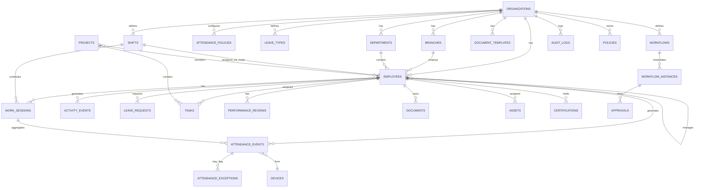

# RecruitConnect OneHR™ - Data Model & ERD
**Version:** 1.0 | **DB:** PostgreSQL 15+ | **ORM:** Prisma | **Date:** 2026-08-31

---

## 1. ERD Overview (Mermaid)



---

## 2. Core Tables

### 2.1 organizations
| Column | Type | Constraints | Notes |
|--------|------|-------------|-------|
| id | uuid PK | default gen_random_uuid() | Tenant root |
| name | varchar(255) | not null | |
| acronym | varchar(10) | not null, unique | For ID generation e.g., RC |
| industry_template | enum | banking/school/hospital/manufacturing/retail/ngo/tech/generic | Section 41 |
| country | varchar(2) | default 'NG' | |
| timezone | varchar(50) | default 'Africa/Lagos' | For remote shift |
| config | jsonb | | Organisation Configuration Engine (42) - workdays, grace_period, overtime_rules etc |
| created_at | timestamptz | | |

**Indexes:** `acronym` unique. Partition strategy: all tenant tables include `organization_id`.

### 2.2 branches
| Column | Type | Notes |
|--------|------|-------|
| id | uuid PK | |
| organization_id | uuid FK → organizations.id | |
| name | varchar | e.g., Lagos Head Office |
| location | geography(Point,4326) | Optional for GPS + Live Map |
| address | text | |
| is_head_office | boolean | |

### 2.3 departments
| Column | Type | Notes |
|--------|------|-------|
| id | uuid PK | |
| organization_id | uuid FK | |
| branch_id | uuid FK nullable | |
| name | varchar | |
| parent_id | uuid FK self | Hierarchy |
| cost_center | varchar | For Digital Twin cost |

### 2.4 employees (Digital Identity - Section 3)
| Column | Type | Constraints | Notes |
|--------|------|-------------|-------|
| id | uuid PK | | |
| organization_id | uuid FK | not null | |
| employee_code | varchar(20) | not null | Format RC-000245, unique per org |
| qr_code | varchar | generated | |
| user_id | uuid FK → users.id | 1:1 auth | |
| photo_url | varchar | | |
| face_profile_ref | varchar | nullable, encrypted | Optional biometric profile |
| department_id | uuid FK | | |
| branch_id | uuid FK | | |
| job_title | varchar | | |
| grade | varchar | | |
| manager_id | uuid FK → employees.id | | |
| employment_type | enum | permanent/contract/intern/volunteer/consultant/seasonal/part-time/full-time | |
| work_arrangement | enum | 14 options (11) | office/remote/hybrid/field/mobile/shift/flexible/project... |
| work_mode | enum | | alias |
| status | enum | active/probation/suspended/exited/alumni | Lifecycle |
| hire_date | date | | For anniversary |
| probation_end_date | date | | |
| skills | jsonb | array | |
| metadata | jsonb | | Certifications, career history, etc normalized also |
| consent_face | boolean | default false | NDPA consent |
| consent_gps | boolean | | |
| created_at | timestamptz | | |
| deleted_at | timestamptz | soft delete | |

**Indexes:** `UNIQUE(organization_id, employee_code)`, `organization_id, status`, `manager_id`, GIN on `skills`.

**ID Generation:** Sequence per org: `SELECT nextval('seq_org_{id}')` → lpad 6 digits.

### 2.5 users (Auth)
| Column | Type | Notes |
|--------|------|-------|
| id | uuid PK | |
| organization_id | uuid FK | |
| email | varchar unique per org | |
| phone | varchar | For SMS/WhatsApp |
| password_hash | varchar | Argon2 |
| role | enum | super_admin/org_admin/hr_admin/manager/employee/recruiter/executive |
| mfa_enabled | boolean | |
| last_login_at | timestamptz | |

### 2.6 attendance_policies (Privacy Control - Section 9, 36)
| Column | Type | Notes |
|--------|------|-------|
| id | uuid PK | |
| organization_id | uuid FK unique | One per org |
| verification_methods | enum[] | standard,gps,qr,biometric,facial,combination |
| require_face_snapshot | boolean | |
| snapshot_capture_events | enum[] | clock_in,clock_out,both |
| snapshot_retention_days | int | 30/90/365 |
| snapshot_access_roles | varchar[] | who can view |
| require_gps | boolean | |
| allowed_locations | geography[] | Geofences |
| grace_period_minutes | int | Lateness grace |
| overtime_requires_approval | boolean | |
| device_registration_required | boolean | |

### 2.7 devices
| Column | Type | Notes |
|--------|------|-------|
| id | uuid PK | |
| organization_id | uuid FK | |
| employee_id | uuid FK | Registered device for employee |
| device_fingerprint | varchar | Hashed identifier |
| device_type | enum | mobile/web/biometric/nfc/api |
| is_authorized | boolean | |
| last_seen_at | timestamptz | |

### 2.8 shifts & rosters (Section 12)
**shifts:**
| Column | Type | Notes |
|--------|------|-------|
| id | uuid PK | |
| organization_id | uuid FK | |
| name | varchar | e.g., Morning |
| type | enum | fixed/flexible/rotational/split/24h/remote/field |
| start_time | time | |
| end_time | time | |
| timezone | varchar | For remote |
| break_duration_minutes | int | |
| flexible_window_start | time | For flexible |
| flexible_window_end | time | |
| is_overnight | boolean | |

**roster_assignments:**
| Column | Type | Notes |
|--------|------|-------|
| id | uuid PK | |
| employee_id | uuid FK | |
| shift_id | uuid FK | |
| date | date | |
| scheduled_hours | decimal | |

### 2.9 work_sessions (Section 5)
| Column | Type | Notes |
|--------|------|-------|
| id | uuid PK | |
| organization_id | uuid FK | |
| employee_id | uuid FK | |
| date | date | |
| shift_id | uuid FK nullable | |
| clock_in_at | timestamptz | |
| clock_out_at | timestamptz nullable | Missing → exception |
| breaks | jsonb | Array [{start,end,duration,status}] |
| gross_duration_minutes | int | Computed |
| break_duration_minutes | int | Sum approved breaks |
| net_working_minutes | int | gross - break |
| scheduled_minutes | int | From shift/roster |
| overtime_minutes | int | net - scheduled (positive only, or approved) |
| late_minutes | int | clock_in vs shift start + grace |
| early_departure_minutes | int | |
| status | enum | working/on_break/clocked_out/missing_clockout/exception |
| verification_score | int | 0-100 (98% Verified) |

**Constraints:** `UNIQUE(organization_id, employee_id, date)`. Index on `date` for daily command center.

### 2.10 attendance_events (Section 4,8)
| Column | Type | Notes |
|--------|------|-------|
| id | uuid PK | |
| organization_id | uuid FK | |
| employee_id | uuid FK | |
| work_session_id | uuid FK | |
| event_type | enum | 17 types: clock_in,break_start,break_end,clock_out,leave_request,hr_request,document_submission,policy_ack,training_completion,performance_checkin,appraisal_submission,manager_approval,login,portal_interaction,task_completion,workflow_action,timesheet_submission |
| timestamp | timestamptz | not null |
| verification_method | enum | 7 methods |
| device_id | uuid FK | |
| location | geography(Point) | If GPS enabled |
| face_snapshot_ref | varchar | S3 key, nullable |
| face_confidence | decimal(5,2) | e.g., 98.00 |
| verification_status | enum | verified/pending/failed |
| ip_address | inet | |
| metadata | jsonb | |

**Partitioning:** By `timestamp` monthly (for scale). Index: `(employee_id, timestamp)`, `(organization_id, date)`.

### 2.11 attendance_exceptions (Section 10,37)
| Column | Type | Notes |
|--------|------|-------|
| id | uuid PK | |
| organization_id | uuid FK | |
| attendance_event_id | uuid FK nullable | |
| work_session_id | uuid FK nullable | |
| employee_id | uuid FK | |
| type | enum | missing_clockout,late_arrival,unapproved_overtime,suspicious_attendance,break_exceeded,duplicate_clock,proxy_suspected,impossible_travel,device_sharing,duplicate_face |
| severity | enum | low/medium/high/critical | Maps to 🔴🟠 |
| status | enum | pending/in_review/resolved/dismissed |
| assigned_to | uuid FK → users | HR reviewer |
| details | jsonb | Evidence: device ids, locations, travel calc |
| created_at | timestamptz | |

### 2.12 activity_events (Workforce Activity Engine - Section 6)
Subset of attendance_events but with `active_session_duration`. Alternatively view over attendance_events where event_type in interaction set. Table for analytics rollup:
| Column | Type | Notes |
|--------|------|-------|
| id | uuid PK | |
| employee_id | uuid FK | |
| date | date | |
| login_sessions | int | |
| active_system_minutes | int | |
| workflow_actions | int | |
| tasks_completed | int | |
| documents_processed | int | |
| approvals | int | |
| training_activities | int | |
| hr_requests | int | |
| computed_at | timestamptz | |

### 2.13 leave_types & leave_requests
**leave_types:** id, org_id, name (annual/sick/maternity etc), accrual_rule jsonb, requires_approval bool, max_days.
**leave_requests:** id, org_id, employee_id, leave_type_id, start_date, end_date, days, status (pending/approved/rejected/cancelled), approver_id, workflow_instance_id, balance_before/after.

### 2.14 performance & tasks (Section 25)
**projects:** id, org_id, name (Lagos Branch Expansion), owner_id, status, start/end, metadata.
**tasks:** id, org_id, project_id nullable, assignee_id, title, status (todo/in_progress/done), priority, due_date, completed_at, estimated_hours. Index on `assignee_id, status` for workload.
**performance_reviews:** id, employee_id, cycle (quarterly/annual), kpi jsonb, manager_assessment enum, overall_indicator, review_date.
**kpis:** id, employee_id, metric, target, actual, progress_pct.

### 2.15 documents, assets, certifications
**documents:** id, org_id, employee_id, type, s3_key, status, expiry_date, verification_status. For incomplete docs risk (Risk Engine).
**assets:** id, org_id, employee_id, name, serial, assigned_at, returned_at.
**certifications:** id, employee_id, name, issued_at, expiry_at, is_mandatory bool. Drives Risk Engine flags.

### 2.16 workflows & automation (Section 33,34)
**workflows:** id, org_id, name, trigger (event), condition jsonb (e.g., probation 3mo), steps jsonb (approver→action→notification→escalation), is_active.
**workflow_instances:** id, workflow_id, entity_type/id (e.g., leave_request), current_step, status, deadline, escalated_at.
**approvals:** id, instance_id, approver_id, status, comment, decided_at.
**notifications:** id, org_id, user_id, channel (email/sms/push/in_app/whatsapp), template, payload jsonb, status, sent_at.
**audit_logs:** id, org_id, user_id, action, entity_type/id, old_value/new_value jsonb, ip, timestamp. Append-only.

### 2.17 policies & knowledge (Section 23,24)
**policies:** id, org_id, title (Employee Handbook), s3_key, embeddings vector(1536) for RAG, version, approved_at.
**knowledge_articles:** id, org_id, category (SOP/manual/FAQ), title, body, embeddings.

### 2.18 talent & marketplace (Section 27,28)
**internal_vacancies:** id, org_id, title, department_id, eligibility_rules jsonb (grade, experience, performance, skills), status.
**applications:** id, vacancy_id, employee_id, status, eligibility_check jsonb.
**talent_opportunities:** id, org_id, type (project/volunteer/mentor), skills_required, status.

### 2.19 workforce_scores (Section 18,19)
**workforce_scores:** id, org_id, branch_id nullable, department_id nullable, date (monthly), attendance_health, performance_health, learning_health, engagement_health, compliance_health, stability, hr_health_overall (computed). Used for Executive Command Center.

---

## 3. Key Relationships & Constraints

- **Multi-tenancy:** Every table has `organization_id` with RLS (Row Level Security) policy: `organization_id = current_setting('app.org_id')::uuid`.
- **Soft Delete:** employees, projects use `deleted_at`.
- **Event Sourcing:** attendance_events immutable (no updates, only inserts + corrections via new event + exception).
- **Geospatial:** Use PostGIS for location, geofence checks via `ST_DWithin`.
- **Vector Search:** `pgvector` for policies/knowledge embeddings.

## 4. Indexes & Performance

- `attendance_events`: BRIN on `timestamp`, GIN on `metadata`, composite `(organization_id, employee_id, timestamp DESC)`.
- `work_sessions`: `UNIQUE(org, employee, date)` + `WHERE status='missing_clockout'` partial index for Exception Center.
- `employees`: Full-text search index on name/code.
- Partition attendance tables monthly, retain raw events 12 months, aggregated activity 3 years.

## 5. Data Retention (NDPA)

- Face snapshots: per `snapshot_retention_days`, auto-delete via pg_cron job.
- Audit logs: 7 years.
- Attendance events: 2 years raw, then aggregated.
- Consent table logs consent version + timestamp.

## 6. Prisma Sketch (Excerpt)

```prisma
model Organization {
  id        String   @id @default(uuid())
  acronym   String   @unique
  employees Employee[]
  branches  Branch[]
}

model Employee {
  id             String   @id @default(uuid())
  organizationId String
  employeeCode   String   // RC-000245
  workArrangement WorkArrangement
  managerId      String?
  manager        Employee? @relation("Manager", fields:[managerId], references:[id])
  subordinates   Employee[] @relation("Manager")
  workSessions   WorkSession[]
  @@unique([organizationId, employeeCode])
  @@index([organizationId, status])
}
```

Full schema to be generated in `prisma/schema.prisma` during scaffold.

